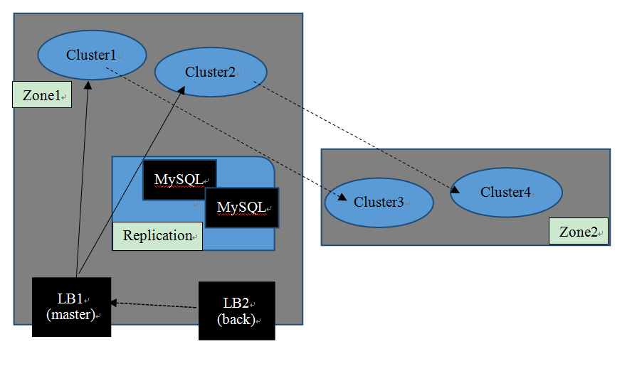
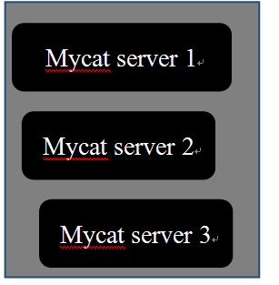
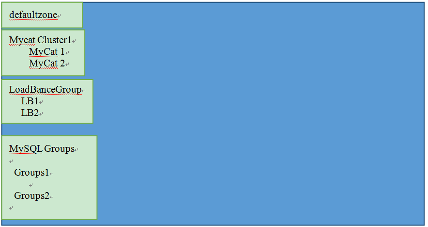
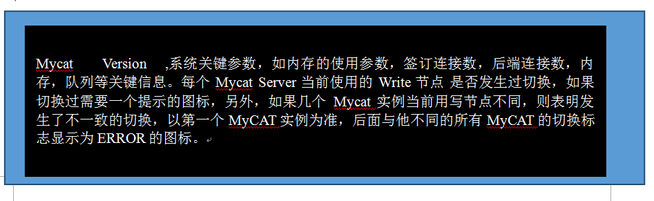
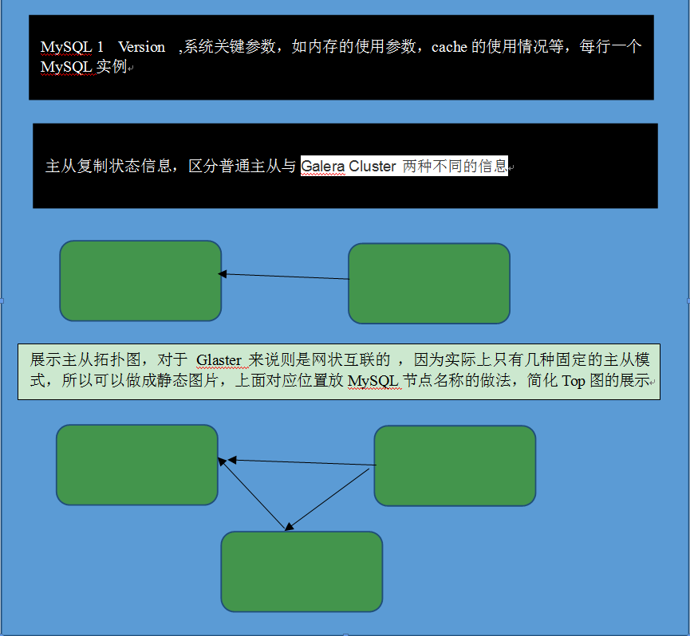

# Mycat 2.0 多中心集群方案
Mycat 2.0 的多中心集群方案，分布于不同地域(zone)内的一些 Mycat Cluster 组成双中心多 3 中心方案，
前提是这些不通中心中的Mycat  Cluster可以以某种方式完成数据库端的数据同步机制。
每个中心都有一组Mycat负载均衡器LB，这些LB与同一中心内的Cluster组成一对多关系，
即一个LB可以服务一个中心内的所有Cluster的负载均衡请求，也可以是多个LB，每个负担不同的Cluster的流量。
此外建议是每一个LB都有一个Backup，平时并不连接Cluster，但监测到Master下线以后，就立即开始连接Cluster并开始工作。



下图是一个 Mycat Cluster的组成部分，它是位于某个特定中心（Zone）的一个处理单元，<br/>
包括，一个Mycat  cluster包括如下信息：<br/>
* 所属的中心（Zone），固定不可变的标示
*	具有地理位置标示，比如北京联通机房1
*	1个或多个采用相同配置（引用同一个MyCat Schema配置）的Mycat Server，用作负载均衡<br />
 <br/>
MySQL数据库服务器，是属于一个Zone内部的共享资源，不属于Cluster级别的，主要拥有以下关键信息：<br/>
*IP地址、端口和名称
*所在主机Host，为了区分数据迁移石时候是否需要复制文件
*MySQL群组，定义一组具备主从关系的MySQL服务器之间的关系
*管理员权限的用户名密码等，用于自动运维操作

此外，配置管理部分，我们需要记录集群中所用的的主机的信息，包括账号密码等,hostId不可变化，<br/>
可以理解为内部分配的一个编号（不同于主机名），在所有的Zone中保持唯一:<br/>

### 主机信息定义
```yaml 
/mycat-hosts/${hostId}
```
demo
```yaml
host_1 value{
           hostname:xxxx,
           ip:xxxx,
           root:xxxx,
           password:xxx 
          }
```
### Zone的值是系统初始配置
在一开始就确定有几个Zone，创建cluster的时候选择下拉

```yaml
/mycat-zones/${zoneId}
```
demo 
```yaml
bj 
   {
    name:北京中心
   }
```
    
### Mycat Server 的节点定义
```yaml
/mycat-nodes/${nodeId}
```
Mycat Server节点定义是这样的:<br/> 
nodeId为每个Mycat Sever的唯一编号，在所有的Zone中保持唯一，<br/>
Server的参数包括用于负载均衡的信息，以及Mycat Server自身的一些特定配置信息。<br/>

demo
```yaml
mycat_bj_01 value:{
		name: mycat_bj_01,
		hostId:host_1
		host:192.178.3.1:8066,
		zone:bj,
		cluster:mycat-cluster-1,
		weigth:1,
		leader:1,
		state:red(red/green/yellow)
		system-params:/params from system.xml
 }
```

### 负载均衡器LB的路径定义 
其中，loadbalance-id是全Zone唯一编号
```yaml
/mycat-lbs/ ${loadbalance-id}
```

 
demo
```yaml
Lb1 value {
          name:load balance bj 01 , 
          hostId:host1 ,
          status:master/standby
          }
```
###负载均衡器LBGroup的定义

```yaml
/mycat-lbs/group{$}
````   
demo  
```yaml 
LBGoup1  value {
                Zone:bj,
                Lb_servers:[
                      Balances: [loadbalance_01, loadbalance_02] 
                     {
                       nodeCluster: mycat-cluster-bj-1,
                       servicePort:8066,
                     },
                     {
                       nodeCluster: mycat-cluster-bj-2,
                       servicePort:8166,
                    }

                         ]
                 
             }   

```
### MySQL节点信息定义
其中，mysqlId是全Zone唯一的，不可改变
```yaml
/mycat-mysqls/${mysqlId}
```
demo
```yaml
   Mysql_1  value{
           ip:192.168.8.2,
           port:3366,
           user:mysql,
           password:mysql,
           hostId:host,
           zone:bj
           }
```        

### MySQL主从复制关系组
MySQL 主从复制关系组是一组有主从复制关系的MySQL实例，即，repgroup-id
```yaml
/mycat-mysqlgroup/${repgroup-id}
```
demo
```yaml
Mysql-rep-1 value {
            repType:0,
            zone:bj,
            [
               {
                  writeHost:mysqlId1,
                  readHosts:mysqlId2, 
                  mysqlId3
                },
                {
                   writeHost:mysqlId3,
                   readHosts:mysqlId4
                 }
            ]
}
```
其中，repType 是用来记录 MySQL 主从之间关系的标识符,<br/>
      repType=0 表示普通的MySQL主从复制关系<br/>
      repType=1 是Galera Cluster 集群

* ZK-Server 中记录了了集群的信息，Mycat-eye、Mycat-Server等从ZK读取配置并协同工作。
* 在Mycat 安装包中提供一个zk-config-bat/sh工具，该工具从 conf/zk-default.txt中加载zk路径到ZK-Server中去，完成ZK-Server数据的初始化过程。
* 然后Mycat-eye与 LB可以用ZK来管理集群。

Mycat-eye的界面原型参考：<br/>


说明：<br/>
*	defaultZone为zk中的第一个zone，是一个下拉框或者可以切换的组件
	<br/>
*	Mycat Cluster1表示对应Zone里第一个cluster，这里需要一个图标来表明是“Cluster”
    <br/>
*   下面的Mycat 1,Mycat 2是属于这个 Cluster的两个Server，也需要一个猫的图标,若有多个Cluster就重复上述显示。<br/>
*	LoadBanlceGroup则为对应Zone里的负载均衡Group，LB1,与LB2为两组负载均衡Group，<br/>
    每个Group是一主一备两个Mycat LB实例组成，必须位于不同的物理服务器上。<br/>
    <br/>
*	MySQL Groups则是对应Zone里的所有MSQL服务器实例，但每个MySQL实例都属于一个Group，<br/>
    Group里的这些实例组成 主从关系，即使没有主从关系的，仍然需要顶一个一个Group，为了未来的扩展。<br/>
    <br/>
*  对于Mycat Cluster实例,点击以后，出现下面的界面



*  对于MySQL Group实例,点击以后,显示如下


